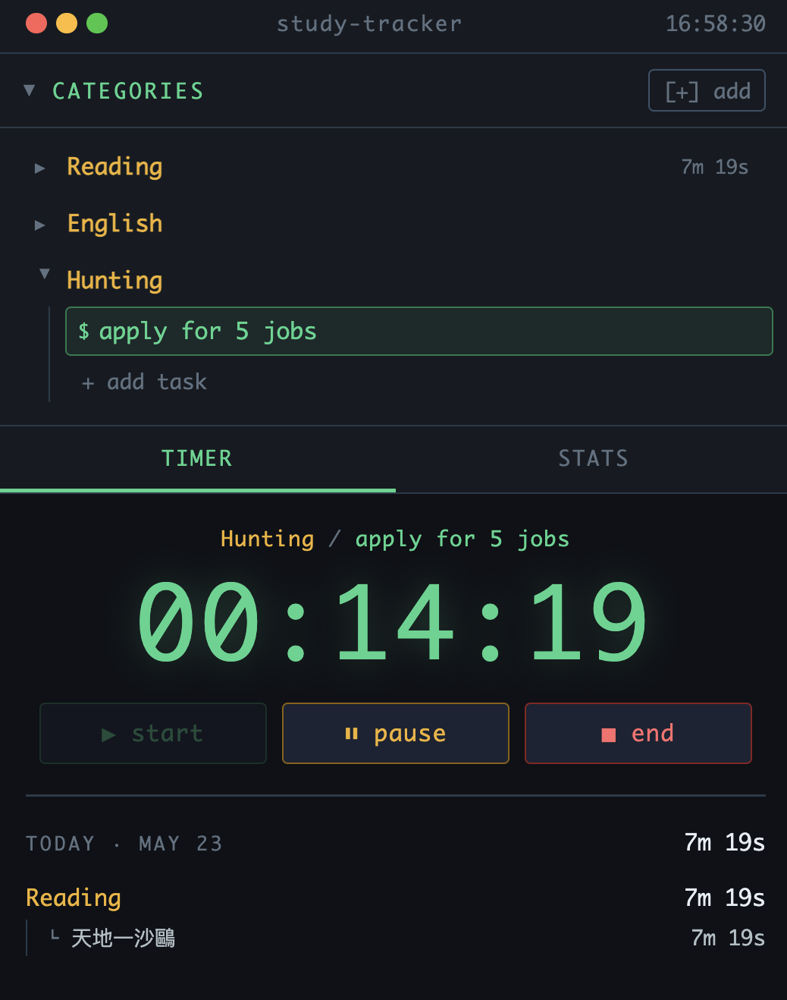

# study-tracker

# study-tracker

A minimal, single-file study timer that runs entirely in the browser — no install, no backend, no dependencies.

## Features

- **Categories & Tasks** — Organize your study topics into categories, each with multiple tasks
- **Timer** — Start, pause, and end sessions per task; time persists across tab switches
- **Today's Summary** — See time spent per task at a glance on the timer tab
- **Stats & History** — Full session history grouped by day and category
- **Export** — Download records as CSV or Excel (`.xls`)
- **Local Storage** — All data is saved in the browser; nothing leaves your device

## Usage

Just open `study-tracker.html` in any modern browser. No server needed.

1. Add a category → add tasks inside it
2. Select a task, then hit **start**
3. Pause or end the session when done
4. Check the **stats** tab to review your history

## Data & Privacy

Everything is stored in `localStorage`. Clearing browser data will erase your records — export first if you need a backup.

## Screenshot

> 

